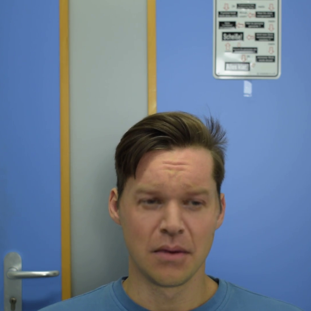
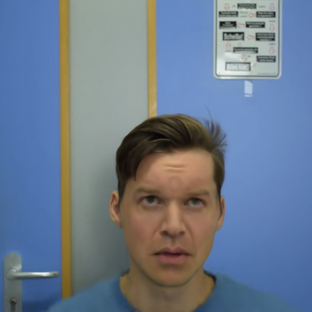
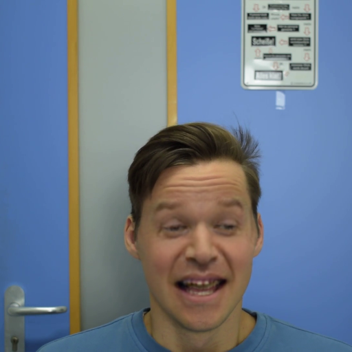
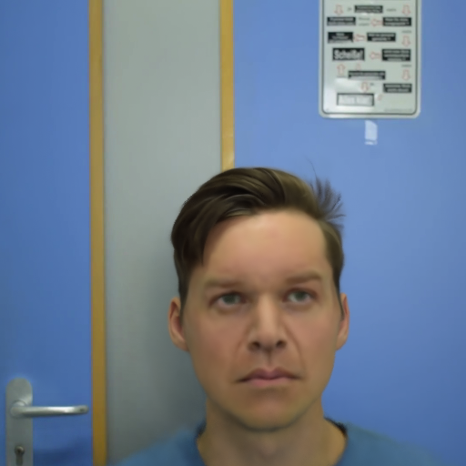
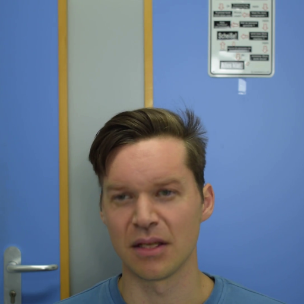
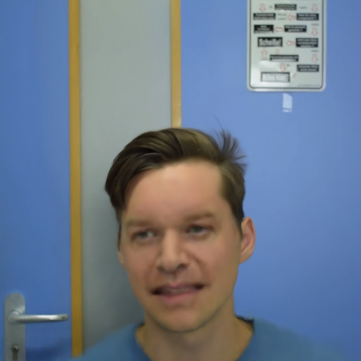
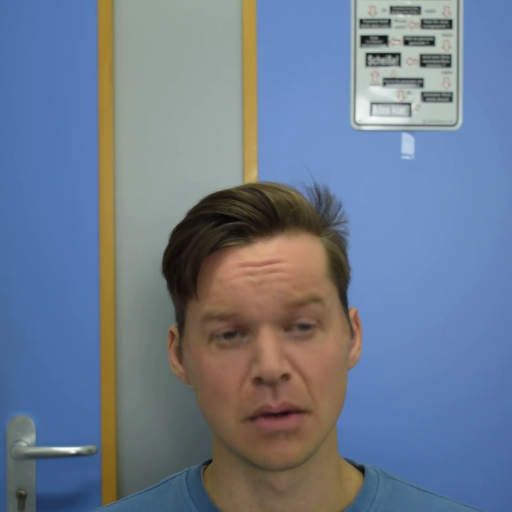
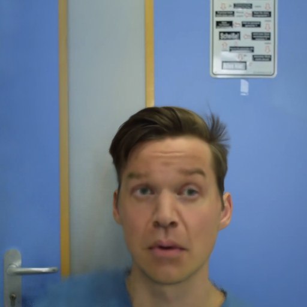
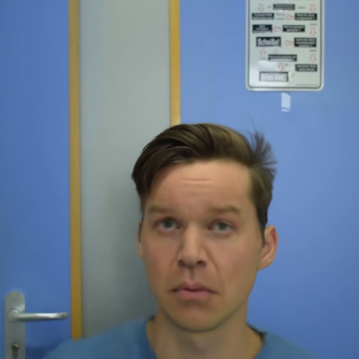

# ImplicitDeepfake

We would like depict steps to reproduce outcomes we achieved and described in paper "ImplicitDeepfake: Plausible Face-Swapping through
Implicit Deepfake Generation using NeRF and Gaussian Splatting". In the aforementioned work we show a novel approach to get 3D deepfake representation of a person using a single 2D photo and a set of images of a base face avatar. Below there is an illustrative movie of such attempt's outcome for Ms. Céline Dion.

https://github.com/quereste/implicit-deepfake/assets/56112943/d3d4b024-c137-455e-9121-367b53874af8


# Update: 4D ImplicitDeepfake

Now it's possible to use our solution to create 4D deepfake representation. As for 3D version we use single 2D photo and video of a base face avatar. Below we present capabilities of our solution.


Original video:


Face to swap with:


Output video:


It's also possible to change facial expressions
| Original        | Changed expression |
|-----------------|--------------------|
|  |  |
|  |  |
|  |  |
|  |  |
|  |  |


# Steps to reproduce for 3D ImplicitDeepfake

1. Download dataset from link: https://drive.google.com/drive/folders/1ZSUoqH1sv3ln-BuWznnDqSx0-Erg5TZU?usp=sharing

This dataset consists of CelebA picture of Ms. Céline Dion (file: famous.jpg) and a directory with train, validation and test pictures of a base face avatar. With every subdirectory there is associated a .json file, containing camera positions, from which specific photos were taken. We hereby stress, that the face avatar we use in this example comes from this link: 
https://sketchfab.com/3d-models/tina-head-530fab5eb2aa44f699052624794aeaa9. We are thankful for this piece of work.

2. Convert every photo from the dataset to a 2D deepfake

Use a 2D deepfake of your choice to convert all the pictures from the dataset directory to their deepfake versions, using file famous.jpg as a target photo. For the experiments we conducted in the paper, we used GHOST deepfake (see citations).

3. Pick a 3D rendering model to be rewarded with a 3D deepfake representation of the target person from step 2

Both NeRF and Gaussian Splatting solutions (see citations) work fine, our pipeline does not demand any specific model though. The result from the short illustrative video comes from Gaussian Splatting model.

# Notebook for your convenience

We created a Colaboratory notebook that covers steps 2 and 3 from above, assuming the use of Gaussian Splatting as the 3D rendering technique. Its content is based on similar notebooks from the repos of the matter. In case of any doubts, feel free to ask us.

Link to notebook at Google Colab: https://colab.research.google.com/drive/1Nsq_pm3JQsNCZNXSGNjSNSGPM1N0_6yr?usp=sharing

# Steps to reproduce for 4D ImplicitDeepfake
1. Download dataset from link: https://syncandshare.lrz.de/getlink/fiFbKE8dEDWYENSr75L9WG/nerface_dataset.zip.

This dataset consists of directory with train, validation and test pictures of a base face avatar. With every subdirectory there is associated a .json file, containing camera positions, from which specific photos were taken.

2. Download photo famous.jpg from link: https://drive.google.com/file/d/1Sss9o6v0aVKN6hP0vz6fNNsWNfjb5ajx/view?usp=sharing

3. Convert every photo from the dataset to a 2D deepfake

Use a 2D deepfake of your choice to convert all the pictures from the dataset directory to their deepfake versions, using file famous.jpg as a target photo. For the experiments we conducted in the paper, we used GHOST deepfake (see citations).

4. Use https://github.com/gafniguy/4D-Facial-Avatars to get 4D avatar facial reconstruction.

   Attention this model requires at least 80GB RAM!

# Citation

We would like to express our gratitude to the authors of Gaussian Splatting and NeRF model, along with the pytorch representation of the latter. We used Gaussian Splatting and NeRF to achieve 3D rendering results.

```
@InProceedings{Gafni_2021_CVPR,
    author    = {Gafni, Guy and Thies, Justus and Zollh{\"o}fer, Michael and Nie{\ss}ner, Matthias},
    title     = {Dynamic Neural Radiance Fields for Monocular 4D Facial Avatar Reconstruction},
    booktitle = {Proceedings of the IEEE/CVF Conference on Computer Vision and Pattern Recognition (CVPR)},
    month     = {June},
    year      = {2021},
    pages     = {8649-8658}
}
```
```
@misc{mildenhall2020nerf,
    title={NeRF: Representing Scenes as Neural Radiance Fields for View Synthesis},
    author={Ben Mildenhall and Pratul P. Srinivasan and Matthew Tancik and Jonathan T. Barron and Ravi Ramamoorthi and Ren Ng},
    year={2020},
    eprint={2003.08934},
    archivePrefix={arXiv},
    primaryClass={cs.CV}
}
```
```
@misc{lin2020nerfpytorch,
  title={NeRF-pytorch},
  author={Yen-Chen, Lin},
  publisher = {GitHub},
  journal = {GitHub repository},
  howpublished={\url{https://github.com/yenchenlin/nerf-pytorch/}},
  year={2020}
}
```
```
@Article{kerbl3Dgaussians,
      author       = {Kerbl, Bernhard and Kopanas, Georgios and Leimk{\"u}hler, Thomas and Drettakis, George},
      title        = {3D Gaussian Splatting for Real-Time Radiance Field Rendering},
      journal      = {ACM Transactions on Graphics},
      number       = {4},
      volume       = {42},
      month        = {July},
      year         = {2023},
      url          = {https://repo-sam.inria.fr/fungraph/3d-gaussian-splatting/}
}
```
Big thanks to the authors of the classical 4D Facial Avatars model. We used it to obtain 4D rendering results.

```
@InProceedings{Gafni_2021_CVPR,
    author    = {Gafni, Guy and Thies, Justus and Zollh{\"o}fer, Michael and Nie{\ss}ner, Matthias},
    title     = {Dynamic Neural Radiance Fields for Monocular 4D Facial Avatar Reconstruction},
    booktitle = {Proceedings of the IEEE/CVF Conference on Computer Vision and Pattern Recognition (CVPR)},
    month     = {June},
    year      = {2021},
    pages     = {8649-8658}
}
```
Big thanks to the authors of the classical 2D deepfake GHOST model.

```
@article{9851423,  
         author={Groshev, Alexander and Maltseva, Anastasia and Chesakov, Daniil and Kuznetsov, Andrey and Dimitrov, Denis},  
         journal={IEEE Access},   
         title={GHOST—A New Face Swap Approach for Image and Video Domains},   
         year={2022},  
         volume={10},  
         number={},  
         pages={83452-83462},  
         doi={10.1109/ACCESS.2022.3196668}
}
```
